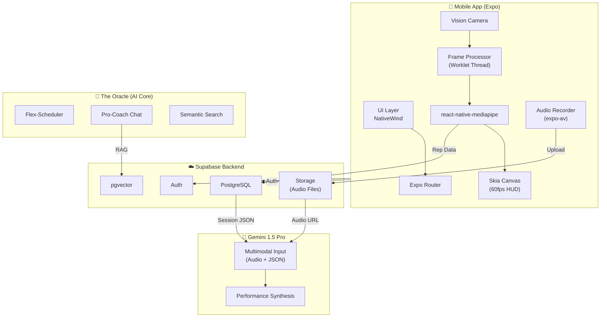
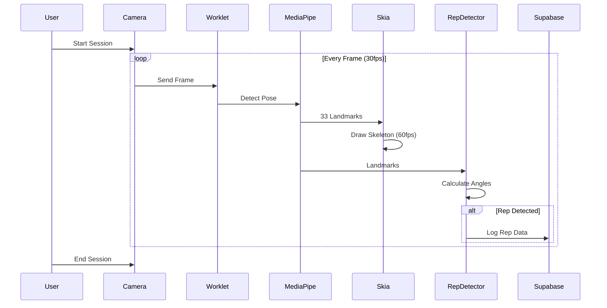
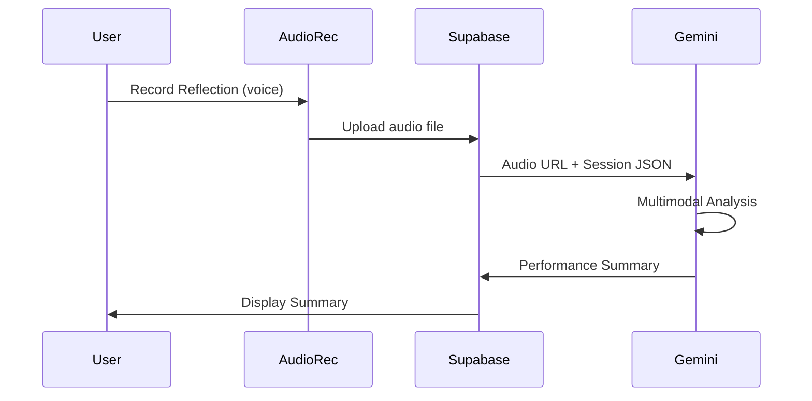
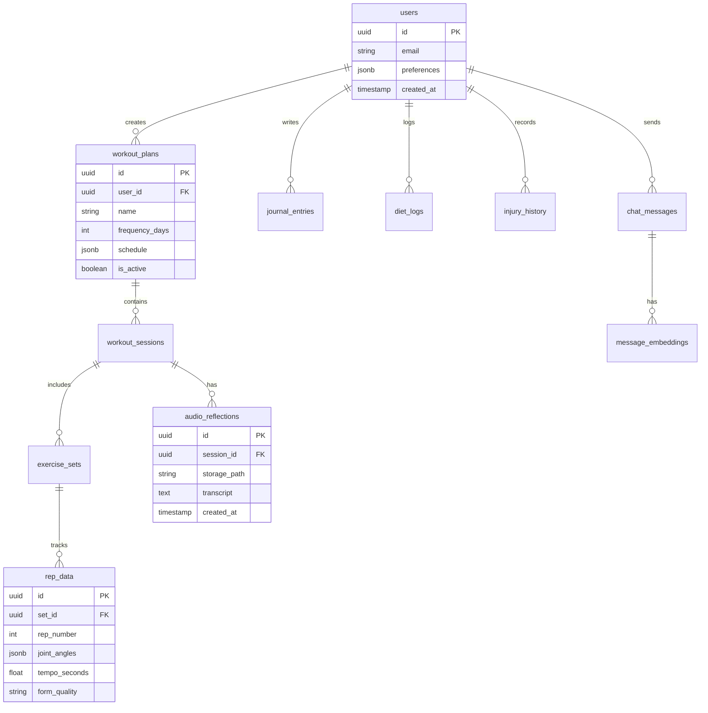

# OpticRep AI Workout Trainer - System Architecture

## Overview

OpticRep is a high-performance, data-driven bodybuilding application that combines real-time computer vision, AI coaching, and comprehensive workout tracking into a seamless mobile experience.

---

## Technology Stack

| Layer | Technology | Purpose |
|-------|------------|---------|
| **Frontend** | React Native + Expo | Cross-platform mobile development |
| **Routing** | Expo Router | File-based navigation |
| **Styling** | NativeWind (Tailwind) | Utility-first styling |
| **Backend** | Supabase | Auth, PostgreSQL, Realtime, Vector |
| **AI/LLM** | Gemini 1.5 Pro | Vision analysis, coaching insights, **multimodal audio** |
| **Vision** | react-native-mediapipe | On-device skeletal tracking (Worklet thread) |
| **Camera** | react-native-vision-camera | High-performance camera access |
| **HUD Rendering** | @shopify/react-native-skia | 60fps skeleton overlay |

---

## System Architecture Diagram



---

## Folder Structure

```
opticrep/
├── app.json                          # Expo config (camera + mic permissions)
├── package.json                      # Dependencies
├── tailwind.config.js                # NativeWind theme
├── tsconfig.json                     # Strict TypeScript
├── babel.config.js                   # Babel + NativeWind
│
├── supabase/
│   └── migrations/
│       ├── 001_initial_schema.sql    # Core tables
│       └── 002_rls_policies.sql      # Row Level Security
│
└── src/
    ├── app/                          # Expo Router screens
    │   ├── _layout.tsx               # Root layout + providers
    │   ├── (auth)/
    │   │   └── login.tsx             # Login screen
    │   └── (tabs)/
    │       ├── _layout.tsx           # Tab navigation
    │       ├── index.tsx             # Dashboard
    │       ├── workout.tsx           # Active session
    │       ├── coach.tsx             # Pro-Coach chat
    │       └── journal.tsx           # Daily journaling
    │
    ├── components/
    │   ├── ui/                       # Primitives (Button, Card, etc.)
    │   └── features/                 # Feature components
    │
    ├── hooks/
    │   ├── useSession.ts             # Workout session state
    │   ├── usePoseDetection.ts       # MediaPipe hook
    │   └── useAudioRecorder.ts       # Voice reflection recording
    │
    ├── lib/
    │   ├── supabase/
    │   │   ├── client.ts             # Supabase client init
    │   │   └── types.ts              # Generated DB types
    │   └── gemini/
    │       └── client.ts             # Gemini API client
    │
    ├── oracle/                       # 🧠 Core AI Logic
    │   ├── scheduler/
    │   │   ├── flex-scheduler.ts     # 1-7 day plan generation
    │   │   ├── exercise-library.ts   # Exercise database
    │   │   └── periodization.ts      # Training cycles
    │   ├── chat/
    │   │   ├── pro-coach.ts          # Chat interface
    │   │   ├── context-builder.ts    # RAG context assembly
    │   │   └── prompts.ts            # System prompts
    │   └── memory/
    │       ├── embeddings.ts         # Text embedding generation
    │       └── vector-search.ts      # Similarity search
    │
    ├── session/                      # 📹 Active Session (Vision)
    │   ├── camera/
    │   │   ├── CameraView.tsx        # Vision Camera + Frame Processor
    │   │   └── permissions.ts        # Camera/mic permission flow
    │   ├── pose/
    │   │   ├── mediapipe-bridge.ts   # react-native-mediapipe wrapper
    │   │   ├── joint-angles.ts       # Angle calculations
    │   │   └── rep-detector.ts       # Rep counting state machine
    │   ├── hud/
    │   │   ├── StatusOverlay.tsx     # Skia <Canvas> HUD
    │   │   ├── skeleton-painter.ts   # Skia path generation
    │   │   ├── audio-cues.ts         # Audio feedback + recording
    │   │   └── status-machine.ts     # Tracking state machine
    │   └── logger/
    │       ├── auto-logger.ts        # Automatic rep/set logging
    │       └── set-manager.ts        # Set tracking
    │
    ├── synthesis/                    # 📊 Post-Workout
    │   ├── pipeline/
    │   │   ├── performance-analyzer.ts  # Gemini multimodal call
    │   │   ├── data-aggregator.ts       # Session data compilation
    │   │   └── summary-generator.ts     # Report generation
    │   ├── override/
    │   │   ├── ManualOverride.tsx       # Correction UI
    │   │   └── validation.ts            # Data validation
    │   └── insights/
    │       ├── InsightsDashboard.tsx    # Analytics display
    │       └── charts.ts                # Visualization helpers
    │
    ├── types/                        # TypeScript definitions
    │   ├── pose.ts                   # Pose landmark types
    │   ├── workout.ts                # Workout/exercise types
    │   └── database.ts               # Supabase table types
    │
    └── utils/                        # Generic utilities
        ├── format.ts                 # Formatting helpers
        └── audio.ts                  # Audio file utilities
```

---

## Key Technical Decisions

### 1. Skia for HUD Rendering

Standard React Native `<View>` components cause lag when updating at 30-60fps. Instead:

```tsx
// StatusOverlay.tsx
import { Canvas, Path, Circle } from '@shopify/react-native-skia';

export function StatusOverlay({ landmarks }: { landmarks: PoseLandmarks }) {
  const skeletonPath = useSkeletonPath(landmarks);
  
  return (
    <Canvas style={StyleSheet.absoluteFill}>
      <Path path={skeletonPath} color="#22c55e" strokeWidth={3} />
      {landmarks.map((point, i) => (
        <Circle key={i} cx={point.x} cy={point.y} r={4} color="#22c55e" />
      ))}
    </Canvas>
  );
}
```

### 2. MediaPipe on Worklet Thread

Pose detection runs on a separate thread to avoid blocking the JS thread:

```tsx
// CameraView.tsx
import { usePoseDetection } from 'react-native-mediapipe';
import { useFrameProcessor } from 'react-native-vision-camera';

const frameProcessor = useFrameProcessor((frame) => {
  'worklet';
  const poses = detectPose(frame); // Runs on Worklet thread
  runOnJS(updatePoseLandmarks)(poses);
}, []);
```

### 3. Gemini Multimodal Audio

User reflections are recorded as audio and sent directly to Gemini (no on-device transcription):

```tsx
// performance-analyzer.ts
const model = genAI.getGenerativeModel({ model: 'gemini-1.5-pro' });

const result = await model.generateContent([
  { inlineData: { mimeType: 'audio/m4a', data: audioBase64 } },
  { text: `Session data: ${JSON.stringify(sessionData)}` },
  { text: 'Generate a performance summary based on the workout data and user reflection.' }
]);
```

---

## Data Flow

### Active Session Flow



### Post-Workout Synthesis Flow



---

## Database Schema Overview



---

## Key Design Principles

1. **Offline-First**: Core tracking works without internet
2. **Privacy-Focused**: On-device pose estimation (no video upload)
3. **Battery-Efficient**: Worklet thread for heavy processing
4. **60fps HUD**: Skia canvas for smooth skeleton rendering
5. **Multimodal AI**: Native audio input to Gemini (no transcription errors)
6. **Type-Safe**: Strict TypeScript throughout

---

## Environment Configuration

```env
# Supabase
EXPO_PUBLIC_SUPABASE_URL=your_supabase_url
EXPO_PUBLIC_SUPABASE_ANON_KEY=your_anon_key

# Gemini AI
EXPO_PUBLIC_GEMINI_API_KEY=your_gemini_key

# Feature Flags
EXPO_PUBLIC_ENABLE_AUDIO_CUES=true
EXPO_PUBLIC_DEBUG_POSE_OVERLAY=false
```

---

## Required Permissions (app.json)

```json
{
  "expo": {
    "plugins": [
      [
        "react-native-vision-camera",
        {
          "cameraPermissionText": "OpticRep needs camera access to track your form during workouts.",
          "enableMicrophonePermission": true,
          "microphonePermissionText": "OpticRep needs microphone access to record your workout reflections."
        }
      ]
    ]
  }
}
```

---

## Version History

| Version | Date | Changes |
|---------|------|---------|
| 0.1.0 | Dec 2024 | Initial architecture design |
| 0.2.0 | Dec 2024 | Added Skia HUD, MediaPipe worklet, Gemini multimodal audio |
